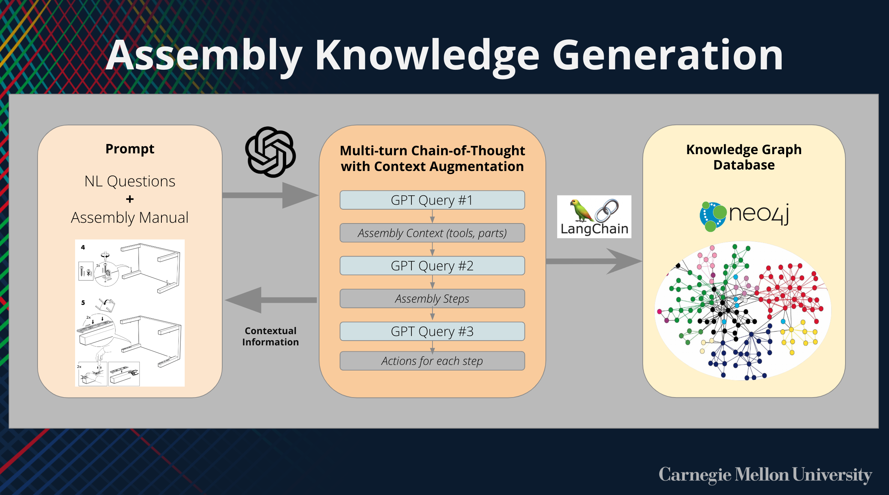
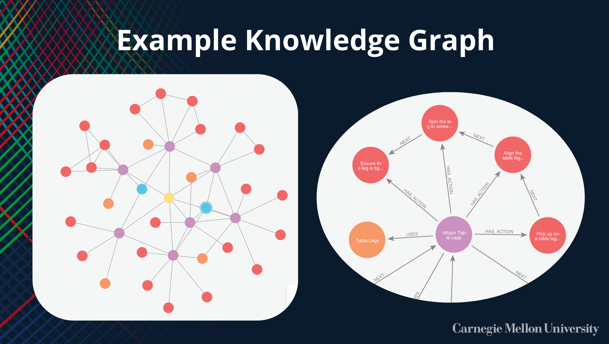
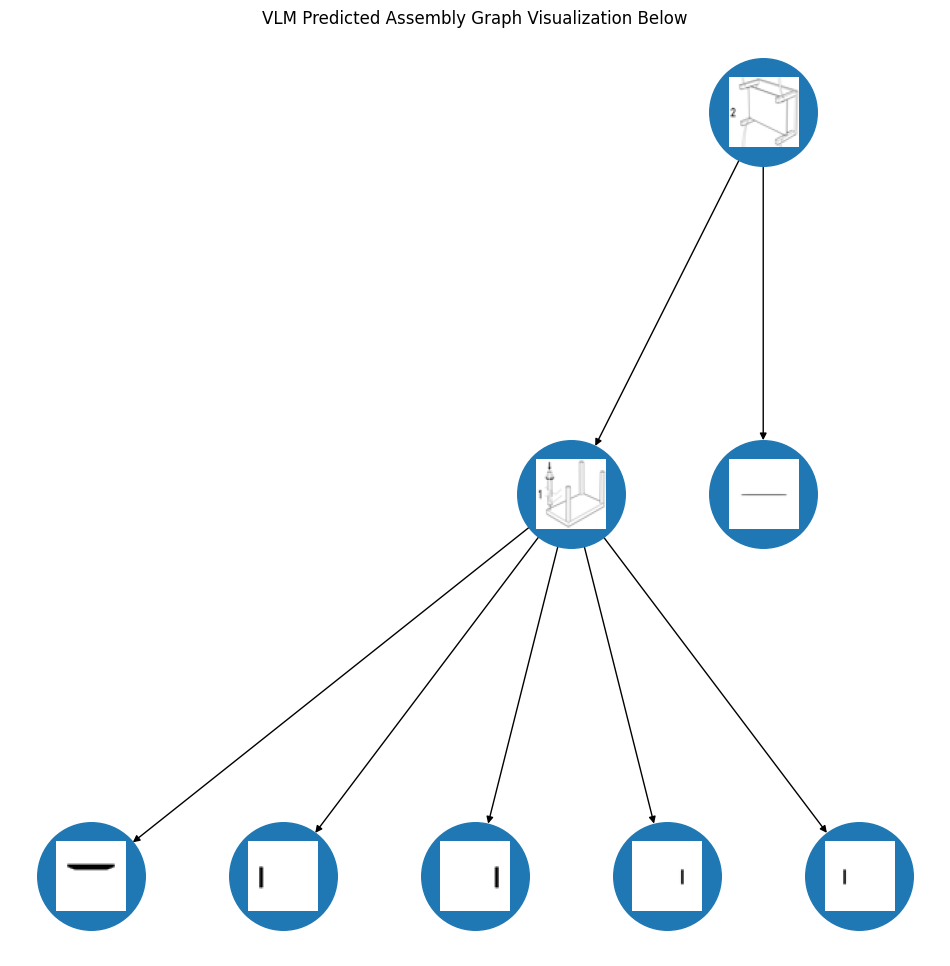
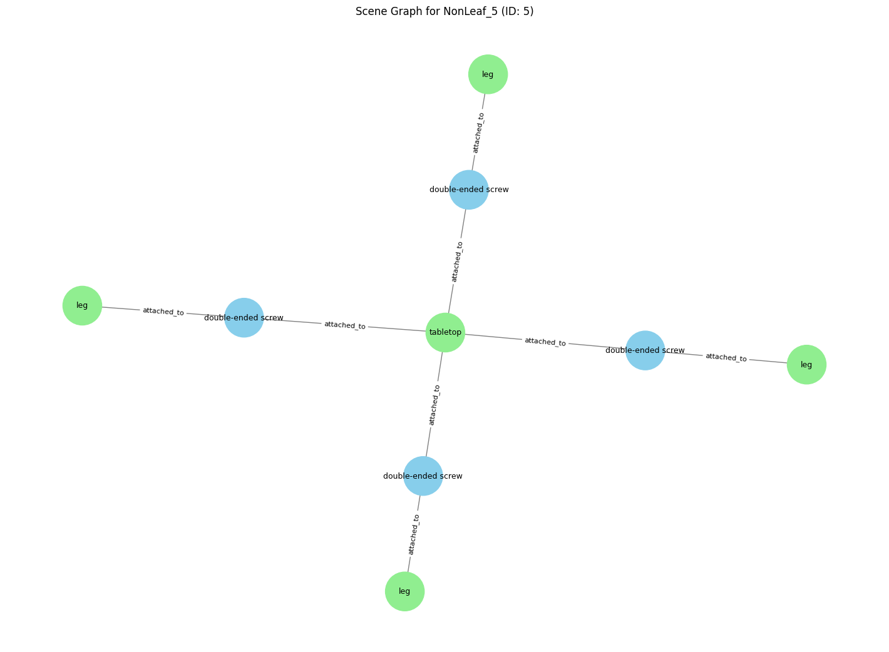

# Long-Horizon Symbolic Planning for IKEA Furniture Assembly

This project explores how robots can understand and execute furniture assembly tasks by combining symbolic reasoning with insights from language and vision models. Instead of relying on end-to-end learning, we extract meaningful structure—like which parts get attached, and how—from IKEA manuals and videos. Using that structure, we build scene graphs, identify components like screws and brackets, and plan robot actions using predefined motion skills. The goal is to bridge the gap between high-level understanding and low-level execution in long-horizon, multi-step tasks like furniture assembly.

---

## 🧠 LLM Understanding of Furniture Assembly

One of our first goals was to understand how much structure a large language model (LLM) could extract from raw IKEA instruction manuals. We prompted GPT with natural language questions and visual inputs (pages from a manual), and asked it to:

- Summarize the overall assembly process
- Identify subassembly structure (e.g., which parts are grouped together)
- Infer attachment relationships and tool usage

Despite the sparse visuals of IKEA manuals, GPT was able to describe high-level intent, track numbered steps, and infer both symbolic and physical dependencies between components.

This process is visualized below:



We extended this further by running a multi-turn prompting process: extract parts and tools, infer the steps, and finally describe actions per step. The resulting data was structured as symbolic triples and stored in a graph database.



These graphs encode not just which parts are used, but how—capturing intent like alignment, insertion, and reinforcement.

In general, LLMs perform well and are able to capture high-level understanding of furniture assembly from sparse diagrams and prompts. However, they still exhibit occasional hallucinations or inaccuracies—especially when reasoning about fine-grained or tool-specific operations, such as interpreting fastener types or nested insertion steps.


---

## 👀 Video Question Answering for Assembly Understanding

To explore perceptual grounding, we tested whether VQA models like [Tarsier](https://github.com/bytedance/tarsier) could interpret IKEA assembly videos. Rather than static images, these models process frames and answer questions about what is happening in the scene.

We used two types of video inputs:
- A full 2-minute IKEA assembly clip of a human building a table
- A short 20-second GIF of a person screwing in a leg


We posed questions like:
- "Describe to me in detail how the person assembles the coffee table."
- "How does the person secure the table legs to the table top?"
- "How is the person attaching the legs to the table top?"

Example answers:
> *The person secures the table legs to the table top by aligning the legs with the holes in the table top and tightening them using a tool, likely a screwdriver.*

> *The process involves positioning the legs, securing them, and tightening them to ensure stability.*

These results show that VQA models can capture high-level actions and object relationships when prompted clearly. However, limitations include:
- Temporal hallucination from limited frame sampling
- Ambiguity in tool identification
- Lack of precision in describing fastener types or insertion constraints

---

## 📘 Manual2Skill Integration

We also worked with [Manual2Skill](https://manual2skill.github.io), a pipeline designed to extract structured symbolic data from IKEA instruction manuals. It performs the following key steps:
- Segments individual parts from manual pages using image processing
- Predicts the assembly order in the form of a tree structure, where each node represents a part or subassembly
- Provides symbolic associations that can be used for task planning, such as which parts get combined and in what sequence



Manual2Skill gives us a coarse but reliable structure of the assembly process. However, while it captures which parts are connected and in what order, it lacks the low-level semantics of how those parts are physically attached.

To bridge this gap, we built a pipeline that extends Manual2Skill’s output using an LLM+VLM system. First, we use the segmented parts and assembly steps from Manual2Skill to create scene graphs for each subassembly. Then, we query an LLM to extract metadata for supporting components such as screws, brackets, and alignment tools. These queries produce structured outputs that describe the function and usage of each component.

Example output:
```json
{
  "number": [115980],
  "name": "double-ended screw",
  "explanation": "Used to connect the four table legs to the tabletop. The screw is inserted halfway into the tabletop and halfway into each leg."
}
```

We also query the LLM again for each step image to infer which parts are connected by which components, and how (e.g., using a double-ended screw inserted halfway into both parts). These symbolic relationships are added to the scene graph as `attached_to` or `passes_through` edges.

This enriched graph representation, grounded in both spatial structure and component semantics, enables symbolic planning over realistic physical interactions—mapping from symbolic relations to executable robot actions.



## ⚙️ From Symbolic Graphs to Robot Actions

LLMs and VLMs can infer symbolic relationships like "attached_to" or "passes_through". These can be represented as scene graphs of target assemblies. However, the challenge is:

**How do we execute these symbolic relationships with a robot?**

Modern methods use deep RL to map symbolic relationships into value-based actions, but they require large datasets and don’t generalize well.

Instead, this project defines a **library of motion primitives** (e.g., `pick`, `orient`, `insert`, `screw_by_hand`, `screw_with_tool`) and associates each type of attachment with a **sequence of executable skills**.

The edges in the symbolic graph are abstract—such as `attached_to(tabletop, leg)`—but we query LLMs using context from the manual and part metadata to infer:
- What tool is used (hand, screwdriver)
- What insertion or alignment is required
- Whether the attachment is bi-directional or constrained

This lets us:
1. Use symbolic edges as goals
2. Match them to a parameterized primitive sequence
3. Generate PDDL plans that compose these sequences into full tasks

The result is a pipeline from symbolic understanding → grounded execution, without the need for large-scale policy learning.

---

